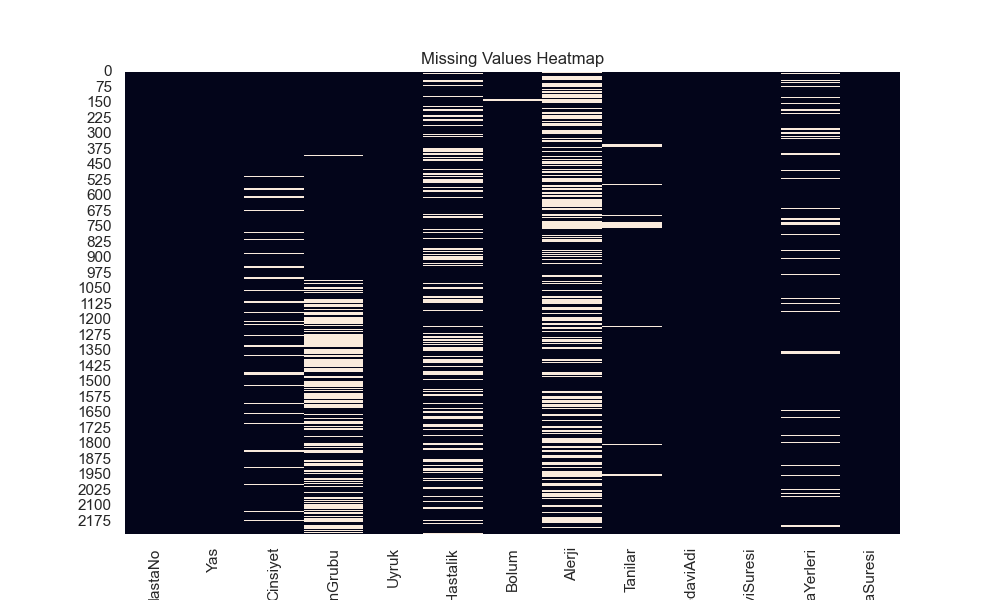
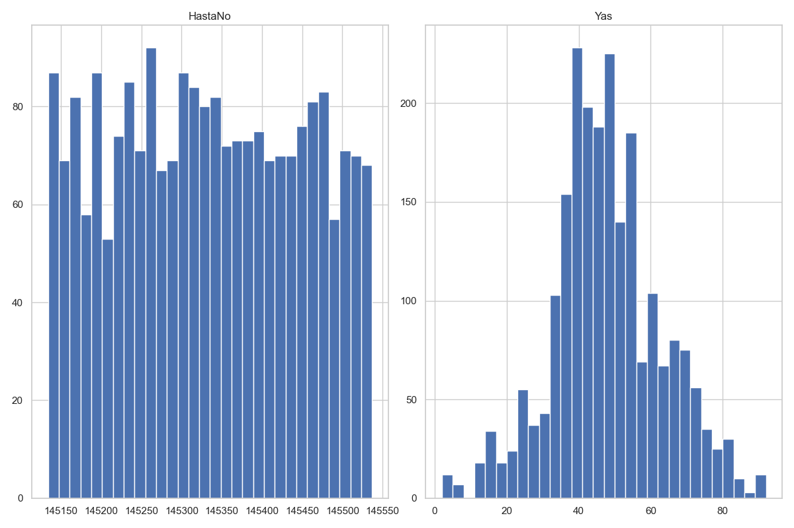
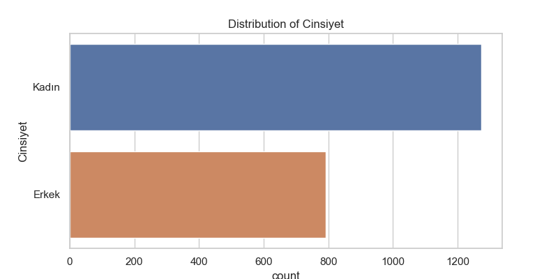
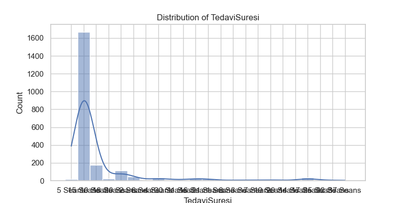
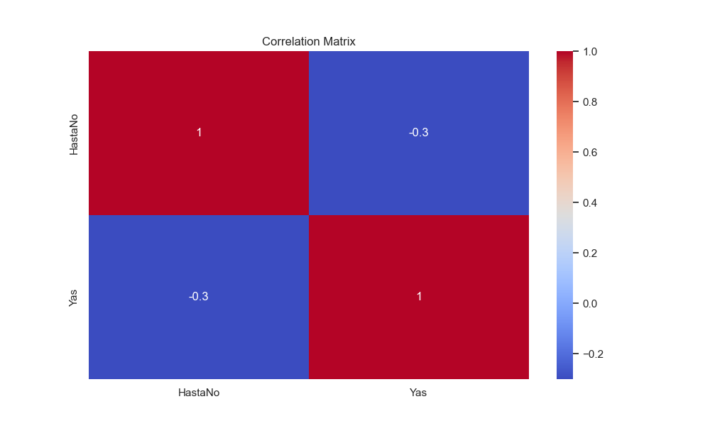

# 📊 EDA Summary – Talent Academy Case Study

## Veri Seti
- Dosya: `data/raw/Talent_Academy_Case_DT_2025.csv`
- Boyut: `N` satır × `M` kolon (detay için `eda.py` çıktısı incelenebilir)
- Hedef değişken: **TedaviSuresi** (tamamen boş olduğu için model kurulmamıştır)

---

## Eksik Değer Analizi
Eksik değer dağılımı:

- Birçok kolonda eksik değer mevcut.
- `TedaviSuresi` tamamen boş.

---

## Sayısal Değişkenler
Sayısal değişkenlerin dağılımları:

---

## Kategorik Değişkenler
Her kategorik değişkenin dağılım grafikleri:

Örnek – **Cinsiyet**

(→ Diğer kategorik kolonların görselleri `outputs/figures/` klasöründe mevcuttur.)

---

## Hedef Değişken – TedaviSuresi

- Kolon tamamen boş olduğundan model kurulamadı.

---

## Korelasyon Analizi
Sayısal değişkenler arasındaki korelasyon matrisi:

---

## Genel Notlar
- Veri ciddi miktarda **eksik değer** içeriyor.  
- Kategorik kolonlarda yüksek kardinalite (çok farklı değer) olanlar var.  
- Pipeline (`prepare_pipeline.py`) ile:
  - Eksik değerler doldurulmuş,  
  - Kategorikler encode edilmiş,  
  - Çoklu-kategorik kolonlardan (Alerji, KronikHastalik vb.) ek özellikler üretilmiştir.  
- Çıktılar:
  - `data/processed/cleaned_dataset.csv`  
  - `models/preprocessor.joblib`  
  - `models/feature_metadata.txt`  

---
